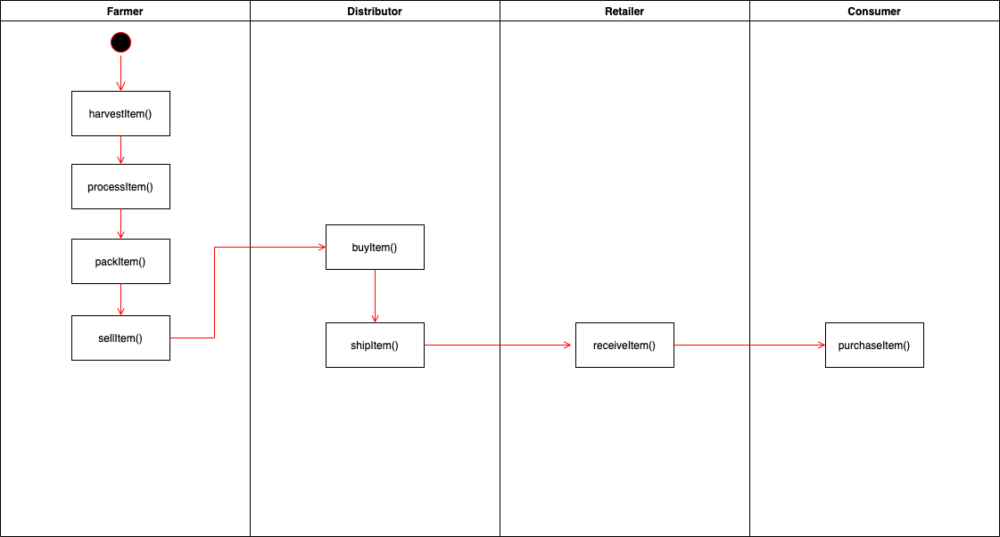
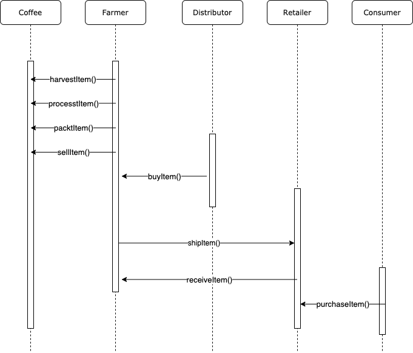
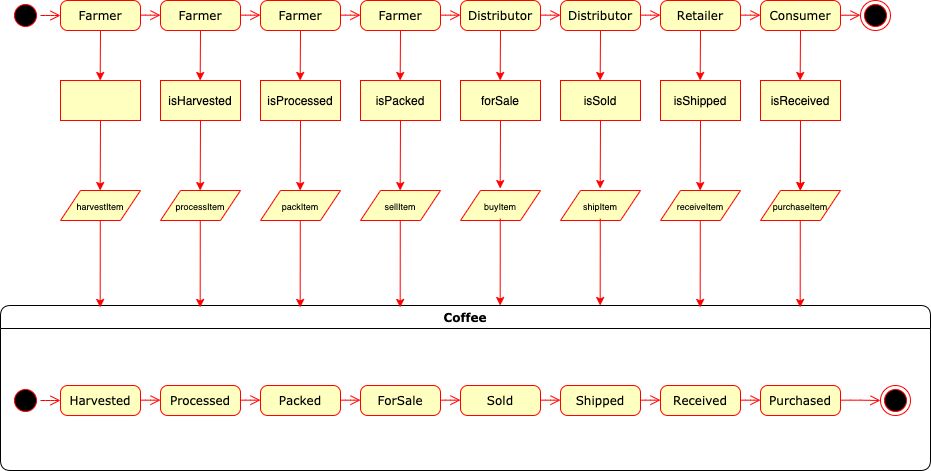
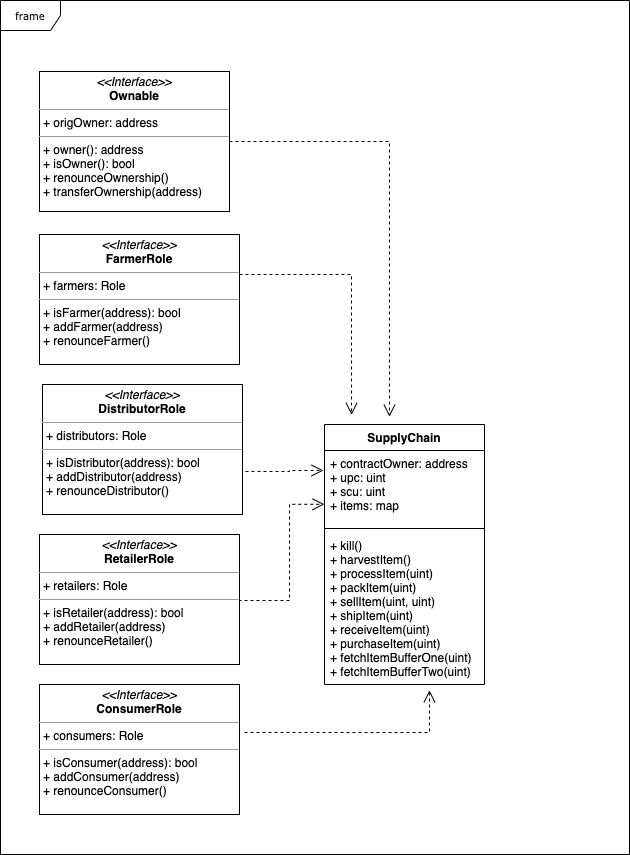

# Supply Chain Solution

This repository containts an Ethereum DApp supply chain solution. It is composed by contracts that manage specific user permission controls as well as contracts that track and verify a product’s authenticity.

## Write-ups

### UML
#### Activity


#### Sequence


#### State


#### Data Model


### Libraries
* Web3: ^0.20.6
* web3.min.js
* truffle-contract: ^4.0.31
* truffle-hdwallet-provider: ^1.0.17

### IPFS
IPFS was not used in this project.

### General
JS library web3.min was added to the project and app.js was "browserified" in order to use ```require```.

Versions:
* Truffle v5.4.1 (core: 5.4.1)
* Solidity v0.5.16 (solc-js)
* Node v14.17.0

## Deploy
Contract address at Rinkeby: 0xEa305EBB6310aD7FeD06675575e35D9Fb07fb28d

## Transaction History
* Harvested - 0xfc929a5062a82f4132ee7a8478be62a9841e311878dfb25d61d406098f4bf297
* Processed - 0x1247935c863657cea7a0fe8a46d6cc7e648a70842dc497f92bf16d8ca3ccde80
* Packed - 0xcb6a93c3e4ff843436d5dd0d9fce0907577fff166c6b976f107c21b6e65cddb3
* ForSale - 0x0042ced065d3992f80cc9c2912d4ace49e379f47c7bf317c79a0f486e76b2c05
* Sold - 0x630f834a0eea33d7e628af0984f070023290603adcd1976debe29c9d8967e1cc
* Shipped - 0xb16f452fc4482bca9ea56ac5866490c945fb36423deb0eaa6794516592ad8960
* Received - 0x7f20ebe7ff622a71e5e7fe6d69785b8325fc8042d3ef9f0880555fa3e0ba20cf
* Purchased - 0x5a5d95bc27ca0de6adf330ff5772f7337a895039b5aa61ccd52070fb4bce124e